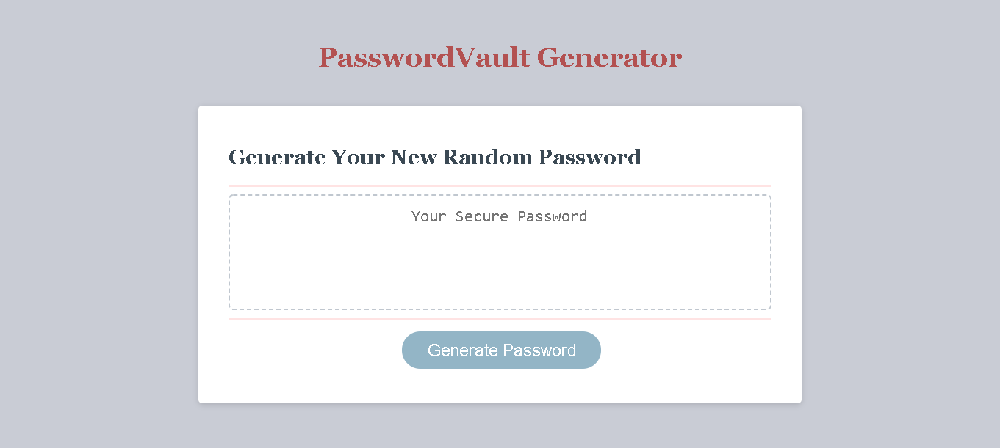

# Passwordvault

This application generates a random password based on the users criteria.
It will run in the browser using dynamic HTML, CSS and JavaScript.

Allows user to generate a brand new secure password through a series of prompts for password criteria.

Password must be between 8 and 128 charactersand the other choices are...
* Uppercase
* Lowercase
* Numbers
* and/or Symbols 

Once password is generated it will be written to the page within the card.

Created by Antonio Huerta

Github link https://github.com/Tonycodesnow/Passwordvault

Live applictation browser link https://tonycodesnow.github.io/Passwordvault/
